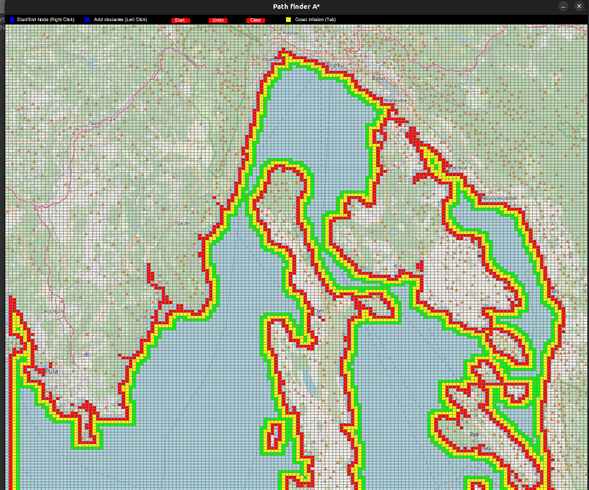
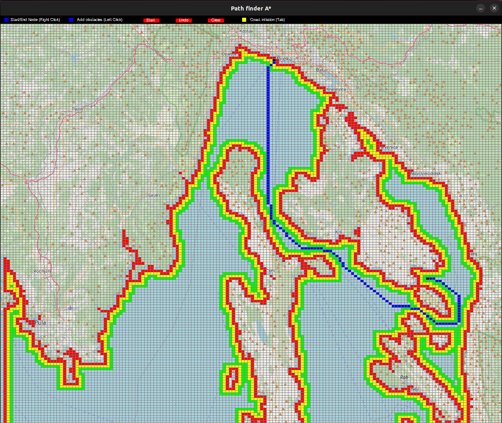
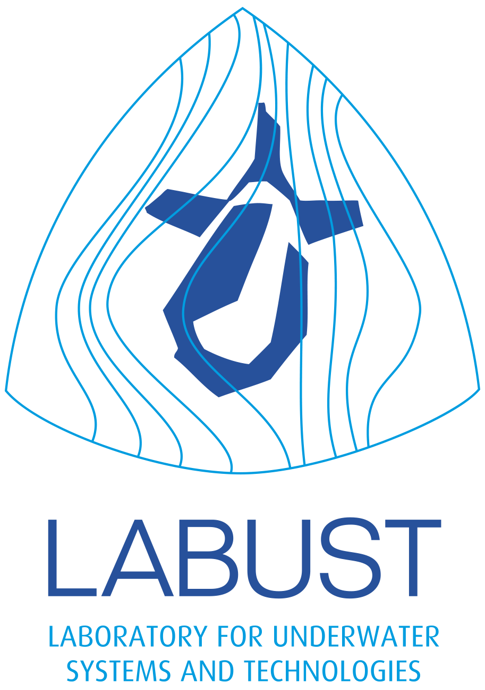

# Path-planning-Demo : Overview of the grid search algorithm A* for global vessel path planning on cost map


This repository is a part of the diploma project at the Faculty of [Electrical Engineering and Computing, University of Zagreb](https://www.fer.unizg.hr/), [Laboratory for Underwater Systems and Technologies](https://labust.fer.hr/). 
Repository is a predecessor of the diploma thesis repository [Model-informed path planning and control for autonomous vessels](https://github.com/kr1zzo/Model-Informed-Path-Planning) and it is used for concept validation and testing of path planning A* algorithm on the 2D grid cost map. The algorithm is implemented in Python and uses the Pygame library for visualization.

## Installing
```terminal
git clone https://github.com/kr1zzo/Path-planning-Demo.git
```

## Requirements

```terminal
pip install -r requirements/requirements.txt
```

## Execution

To run the simulation, in the `scripts` folder execute the following command in the terminal:

```bash
python3 pathfinder.py
```

1. Press Tab to generate costmap
2. Select the start and goal point by clicking on the map (left click)
3. Add optional obstacles by clicking on the map (right click)
4. Press start to run the path planning algorithm

<p align="center">

</p>
<p align="center">
<em>
Figure 1: Costmap generated by the path planning algorithm
</em>

## Results

Results and detailed project descriptions can be found in the `documentation/report.pdf` file. The report discusses how different cost map values and heuristic functions affect the path planning algorithm's performance for the different start and goal points. The report also discusses the algorithm's limitations and possible improvements.
Check out the [Model-informed path planning and control for autonomous vessels](https://github.com/kr1zzo/Model-Informed-Path-Planning) repository for more advanced path planning algorithms and control strategies.

<p align="center">

</p>
<p align="center">
<em>
Figure 2: Example of A* path-planning between Rijeka and Baška, island Krk in Croatia 
</em>


## Credits

#### [&copy; Faculty of Electrical Engineering and Computing, University of Zagreb, 2024](https://www.fer.unizg.hr/)

#### [&copy; Laboratory for Underwater Systems and Technologies (LABUST)](https://labust.fer.hr/)




&NewLine;

Contributors names and contact info

Author|GitHub | e-mail
| :--- | :---: | :---:
Enio Krizman  | [@kr1zzo](https://github.com/kr1zzo) | enio.krizman@fer.hr

Mentors | e-mail
| :--- | :---: 
Doc. Dr. Sc. Đula Nađ  | dula.nad@fer.hr
Dr. Sc. Nadir Kapetanović  | nadir.kapetanovi@fer.hr
